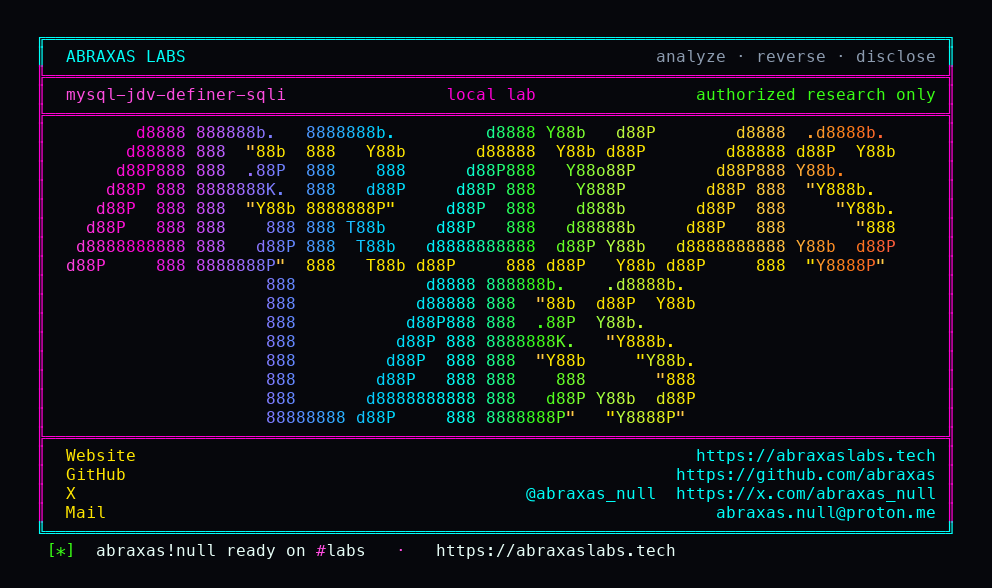

<p align="center">
  
</p>

<p align="center">
  <a href="https://abraxaslabs.tech"><strong>abraxaslabs.tech</strong></a>
  &nbsp;·&nbsp;
  <a href="https://github.com/abraxas">github.com/abraxas</a>
  &nbsp;·&nbsp;
  <a href="https://x.com/abraxas_null">@abraxas_null</a>
  &nbsp;·&nbsp;
  <a href="mailto:abraxas.null@proton.me">abraxas.null@proton.me</a>
  &nbsp;·&nbsp;
  <a href="https://github.com/abraxas/mysql-jdv-definer-sqli">mysql-jdv-definer-sqli</a>
</p>

# mysql-jdv-definer-sqli

**Class:** SQLi
**Reach:** Remote

**MySQL Community Server** `mysqld` `26.7.0` (`06a5c1c`) - Oracle

JSON Duality DML concatenates JSON string values with `escape_string_for_mysql` (backslash only), then `parse_sql` under the invoker `sql_mode` after swapping to the view DEFINER sctx. `SET SESSION sql_mode='NO_BACKSLASH_ESCAPES'` makes `\'` end the SQL literal. A JSON string containing `'` injects a subquery / SET-list as DEFINER. Lab: invoker with only DML on the view reads `secret.s` into the projected `name` column.

Default CREATE VIEW is DEFINER. X Plugin already branches on that mode. JDV does not. Feature-gated: needs a JSON Duality View.

| | |
|---|---|
| ID | no CVE yet |
| Class | **SQLi** (DEFINER; not RCE) |
| Reach | **Remote** (authenticated SQL; needs DML on a JSON Duality View) |
| CWE | [CWE-89](https://cwe.mitre.org/data/definitions/89.html) |
| CVSS | **High: 8.1** `CVSS:3.1/AV:N/AC:L/PR:L/UI:N/S:U/C:H/I:H/A:N` |
| Product | [MySQL Community Server](https://github.com/mysql/mysql-server) `mysqld` |
| Affected | **26.7.0** (`06a5c1c99c377fc41b2eba1ea244e8b220bdc3c8`) |
| Auth | authenticated; INSERT or UPDATE on a JSON Duality View |
| License | [GNU Affero GPL v3.0](LICENSE) |
| Lab | `127.0.0.1` only. Witness in projected `$.name`. |

## What an attacker can do

Hold DML on a `SQL SECURITY DEFINER` JSON Duality View. `SET SESSION sql_mode='NO_BACKSLASH_ESCAPES'`. UPDATE (etag from SELECT) a string field whose JSON value contains `'`. The generated `_utf8mb4 '...'` literal ends. The rest of the statement runs as DEFINER. Lab selects `secret.s.note` into the projected `name` column. Direct `SELECT` on `secret.s` is 1142.

Without that sql_mode the same JSON stores as a literal name. The quote stays data.

## How I found it

Same 26.7.0 hunt. Default daemon unpublished Crit/High was empty. JSON Duality DML still concatenates values.

```c
sbuf.append("_utf8mb4 '");
escape_string_for_mysql(&my_charset_utf8mb4_bin, ...);
sbuf.append(1, '\'');
```

`create_sctx_guard` installs `view_sctx` before `run_substmt`. Invoker `sql_mode` is what `parse_sql` sees.

Wrong turns: `SQL SECURITY DEFINER` between the view name and `AS` is 1064 (default is already DEFINER). Same `name` as the current row is skipped (`is_equal`); inject against a different value. Etag is required.

## Lab

```bash
cd lab
./run.sh
```

Image `mysql:26.7.0`. Published `127.0.0.1:18640`. View `app.dv` DEFINER `root`@`%` over `app.t`. Secret in `secret.s`. Victim has SELECT/INSERT/UPDATE on the view only.

```text
SUCCESS mysql-jdv-definer-sqli victim-secret=denied nbe-inject=yes view-has-witness=yes default-mode-inject=no dump=26.7.0 image=mysql:26.7.0 MYSQL-JDV-DEFINER-SQLI-WITNESS
```

## The fix

Escape JDV DML strings with the same `NO_BACKSLASH_ESCAPES` branch X Plugin already has (`escape_sql_quote` vs `escape_string_for_mysql`). Parameterize the generated INSERT/UPDATE. Do not `parse_sql` concatenated values under a DEFINER sctx.

## References

- [github.com/mysql/mysql-server](https://github.com/mysql/mysql-server) tag [mysql-26.7.0](https://github.com/mysql/mysql-server/tree/mysql-26.7.0) (`06a5c1c99c377fc41b2eba1ea244e8b220bdc3c8`)
- [sql/json_duality_view/dml.cc](https://github.com/mysql/mysql-server/blob/mysql-26.7.0/sql/json_duality_view/dml.cc) `append_json_dom` / `create_sctx_guard`
- Sibling packs: [abraxas/mysql-mysqldump-show-tables-overflow](https://github.com/abraxas/mysql-mysqldump-show-tables-overflow) · [abraxas/mysql-mysqldump-tab-path](https://github.com/abraxas/mysql-mysqldump-tab-path) · [abraxas/mysql-mysqlbinlog-raw-path](https://github.com/abraxas/mysql-mysqlbinlog-raw-path) · [abraxas/mysql-set-role-leftover](https://github.com/abraxas/mysql-set-role-leftover)
